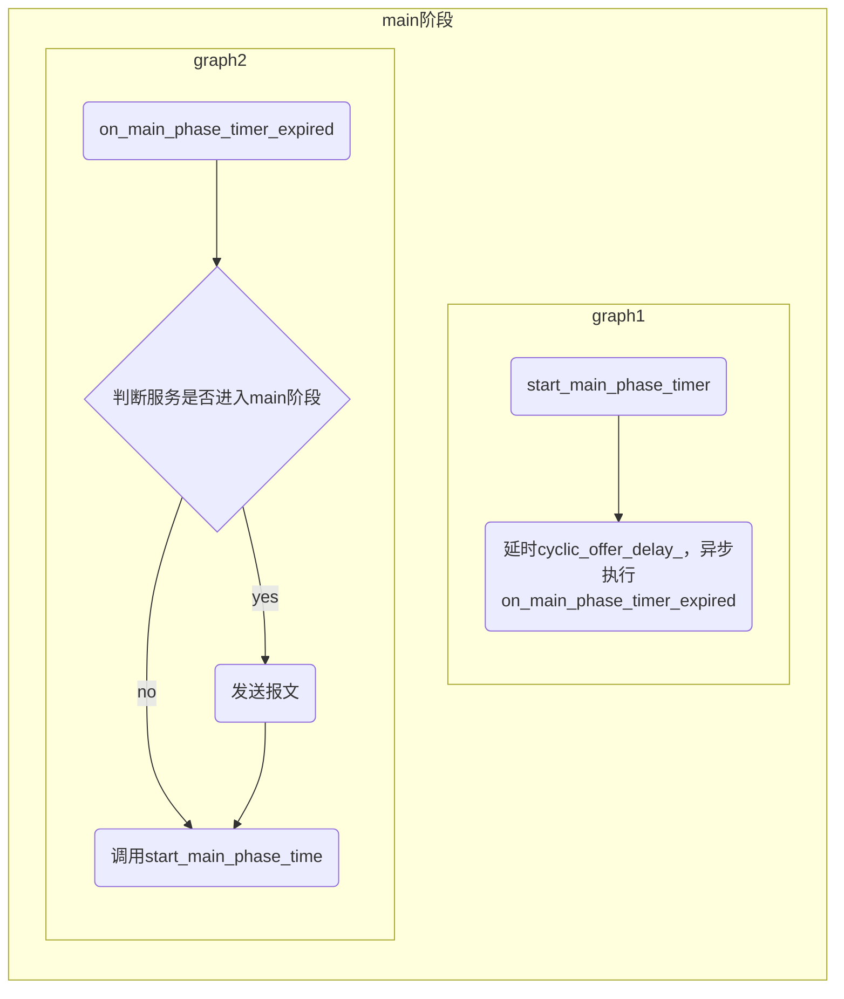
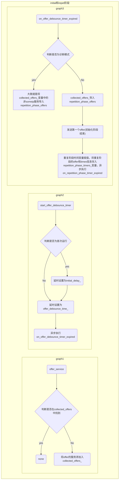
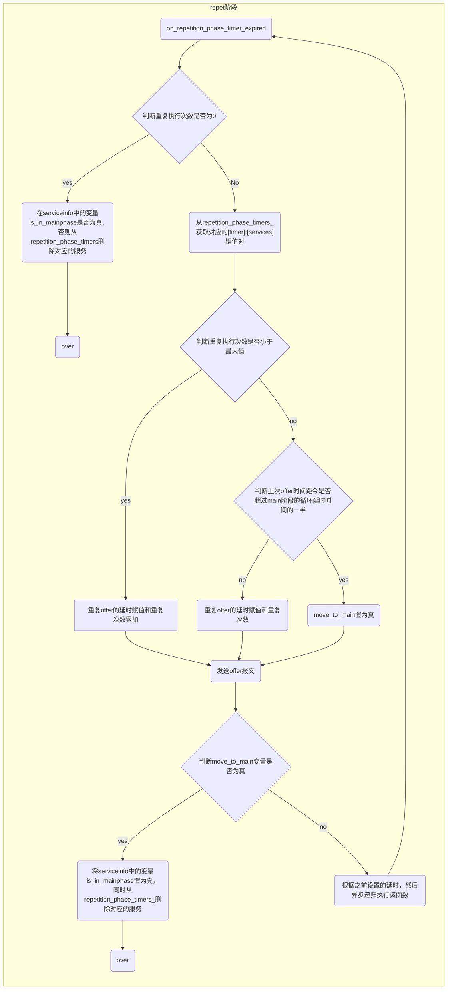

## 服务发现UML类图

服务发现模块类之间的关系较为复杂，为了方便理解。这里先对各个主要类进行简单的说明。

**注意**：类的详细说明见链接。

- **runtime和runtime_impl**：

  service discovery类的构造工厂类。可以创建service_discovery_impl类的实例。runtime是纯虚类，runtime_impl继承runtime。

- **service_discovery_host**：

  纯虚类，Routing Manager相关类（没有包括在此UML类图中）继承于此类。service_discovery_impl类中包括指向此类的指针，所以service_discovery_impl可以通过指向service_discovery_host的指针间接使用Routing Manager相关类（例如：发送消息）。

- **service_discovery和service_discovery_impl**：

  service_discovery是纯虚类，service_discovery_impl继承service_discovery类实现所有的纯虚函数。服务发现相关的处理逻辑在此类中实现。

- **request**：

  保存请求服务相关的信息。service_discovery_impl中保存有request的容器，可以处理相关服务发现的逻辑。

- **subscription**：

  pass

- **remote_subscription_ack**：

  pass

- **message_element_impl**：

  所有message相关类的基类，message_elemen_impl中有指向message_impl的指针。其他类（entry_impl相关类和option_impl相关类）可以通过调用`get_owning_message()`获得指向message_impl类指针。

- **message_impl**：

  组合所有message相关的类，`entries_`（`std::vector<std::shared_ptr<entry_impl>>`）和`options_`（`std::vector<std::shared_ptr<option_impl>>`）保存了所有的entry_impl相关类和option_impl相关类。

- **entry_impl**：

  entry相关类的基类。

- **option_impl**：

  option相关类的基类。

## offer service流程

