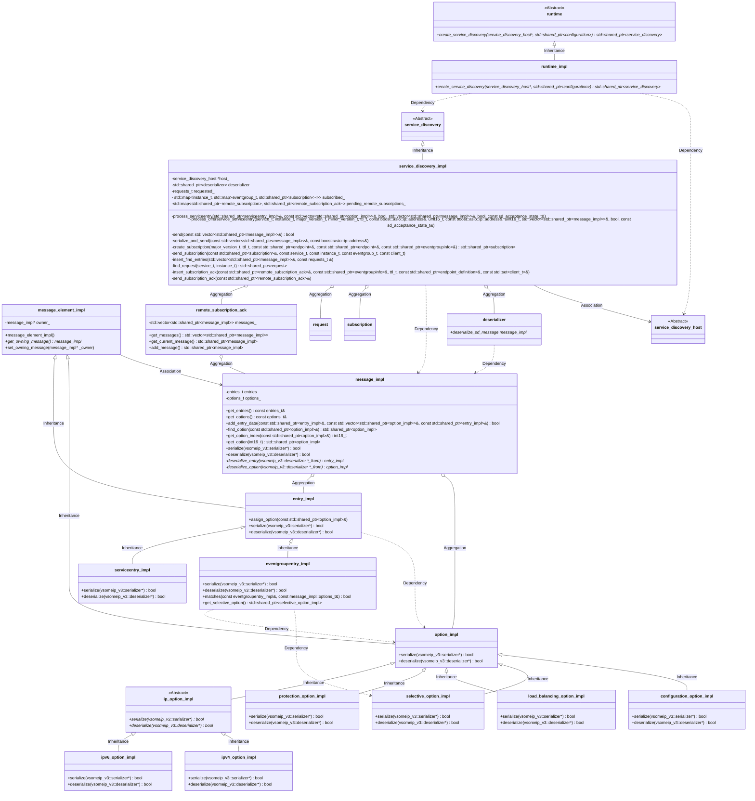
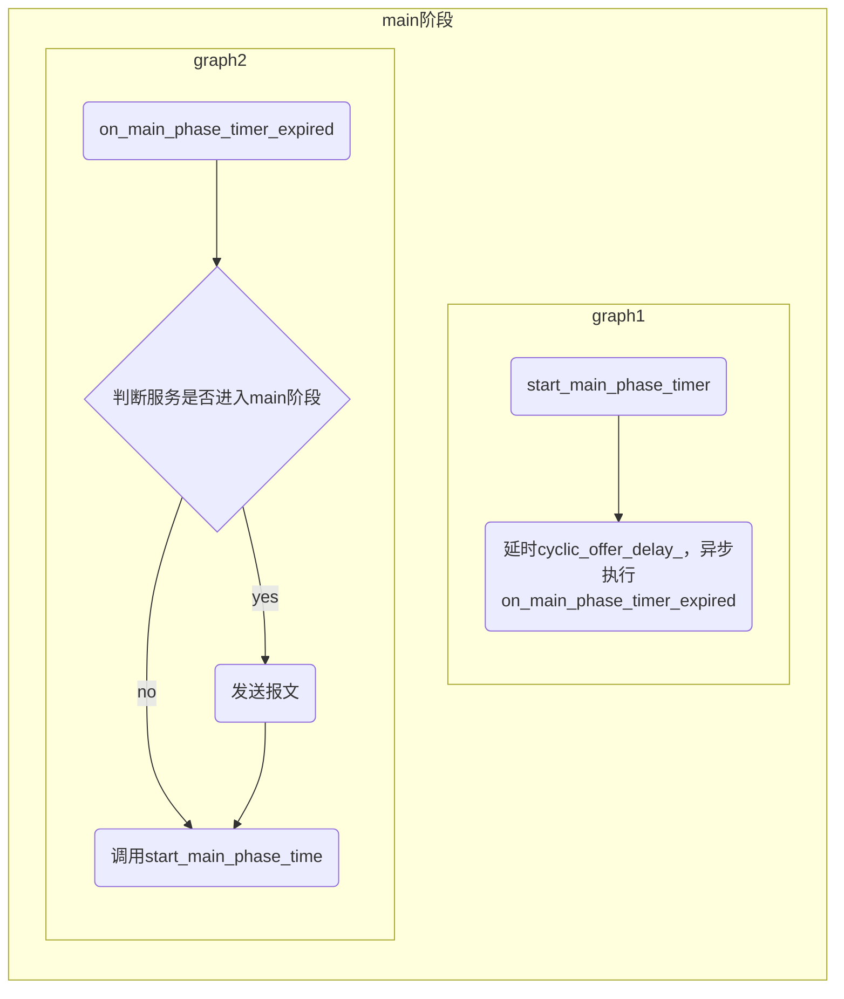
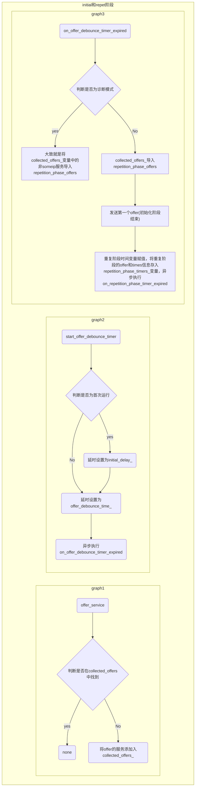
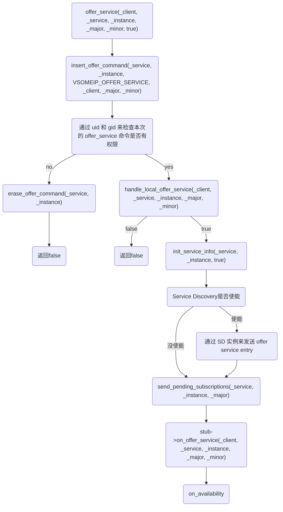
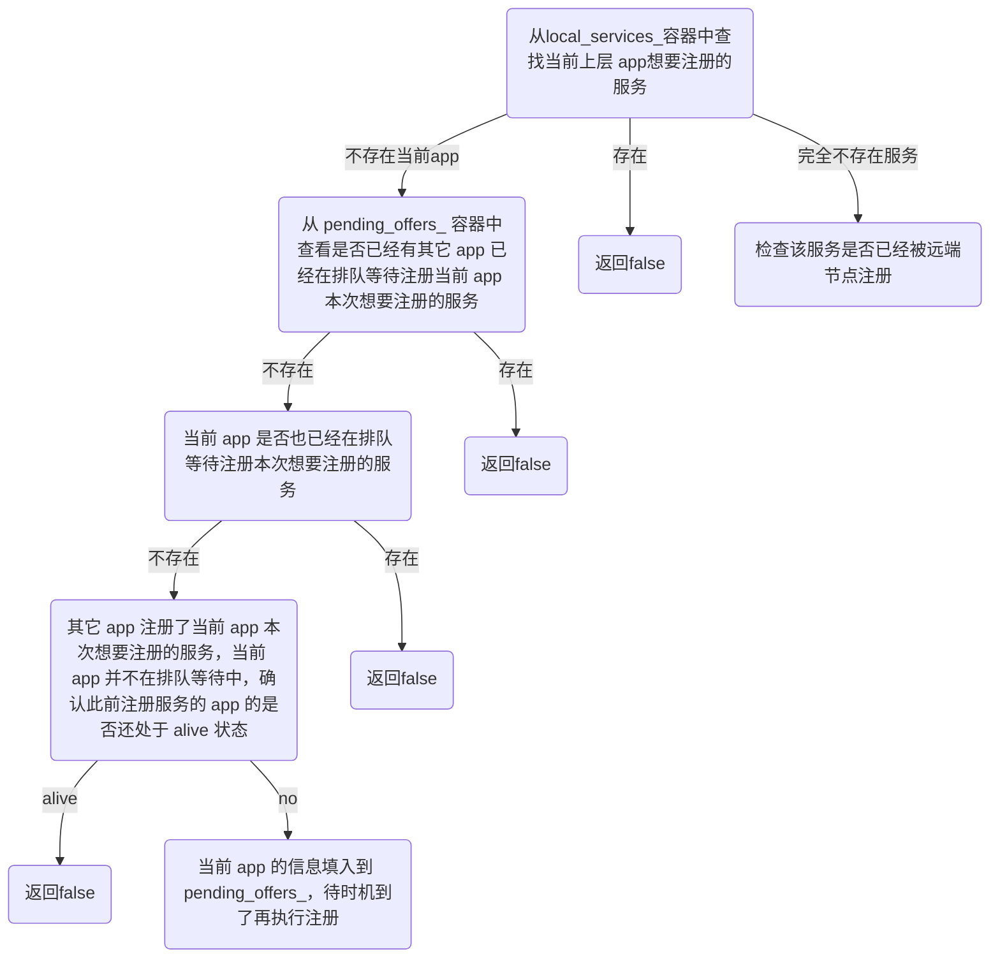
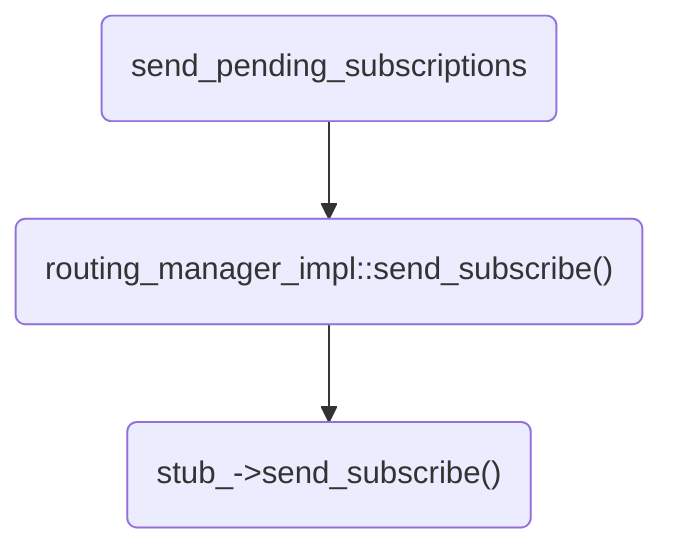
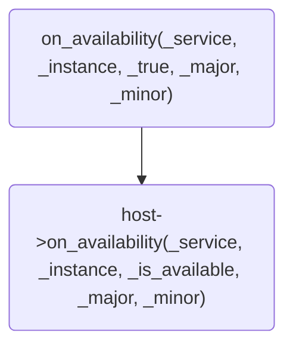

## 服务发现UML类图

服务发现模块类之间的关系较为复杂，为了方便理解。这里先对各个主要类进行简单的说明。

**注意**：类的详细说明见链接。

- **runtime和runtime_impl**：

  service discovery类的构造工厂类。可以创建service_discovery_impl类的实例。runtime是纯虚类，runtime_impl继承runtime。

- **service_discovery_host**：

  纯虚类，Routing Manager相关类（没有包括在此UML类图中）继承于此类。service_discovery_impl类中包括指向此类的指针，所以service_discovery_impl可以通过指向service_discovery_host的指针间接使用Routing Manager相关类（例如：发送消息）。

- **service_discovery和service_discovery_impl**：

  service_discovery是纯虚类，service_discovery_impl继承service_discovery类实现所有的纯虚函数。服务发现相关的处理逻辑在此类中实现。

- **request**：

  保存请求服务相关的信息。service_discovery_impl中保存有request的容器，可以处理相关服务发现的逻辑。

- **subscription**：

  pass

- **remote_subscription_ack**：

  pass

- **message_element_impl**：

  所有message相关类的基类，message_elemen_impl中有指向message_impl的指针。其他类（entry_impl相关类和option_impl相关类）可以通过调用`get_owning_message()`获得指向message_impl类指针。

- **message_impl**：

  组合所有message相关的类，`entries_`（`std::vector<std::shared_ptr<entry_impl>>`）和`options_`（`std::vector<std::shared_ptr<option_impl>>`）保存了所有的entry_impl相关类和option_impl相关类。

- **entry_impl**：

  entry相关类的基类。

- **option_impl**：

  option相关类的基类。



## offer service流程






### app的offer_service 梳理
几个关键的容器：

1. routing_manager_impl 的私有 map 型容器 offer_commands\_，pending_offers\_
2. routing_manager_base 的 protected 的 map 型容器 local_services_，（由于是 protected 的，所以该容器应该是 routing_manager_impl 和 routing_manager_proxy 共享的）
3. routing_manager_base 的私有的 services_，该容器会记录所有已经注册了的服务的信息，包括 local 和 remote 的服务，在服务发现的main阶段，sd模块会调用routing_manager_base提供的公共接口routing_manager_base::get_services来获取已经注册了的服务的信息，然后发送offer_service报文



routing_manager_impl 路由管理器的实例中通过一个私有的map型容器 offer_commands_ 来维护所有来自app层的offer_service()调用，其具体类型定义如下：

```c++
std::map<std::pair<service_t, instance_t>, std::deque<std::tuple<uint8_t, client_t, major_version_t, minor_version_t>>> offer_commands_; 
```

insert_offer_command() 就是将当前来自 app 层的一个 offer_service 命令存入到这个容器中。

insert_offer_command()会从安全性考虑，结合 uid 和 gid 来检查本次的 offer_service 命令是否有权限，若没权限，就从 offer_commands_ 容器中将刚存入offer_service通过`erase_offer_command(_service, _instance)`删掉，并返回。

routing_manager_impl 继承的父类 routing_manaer_base 中使用一个 map 类型的容器 local_services_ 来维护本地服务，其具体类型定义如下：

```c++
typedef std::map<service_t, std::map<instance_t, std::tuple<major_version_t, minor_version_t, client_t>>> local_services_map_t;
local_service_map_t local_services_;
```

handle_local_offer_service()中会先进行以下几个方面的检查工作：




1. 从 local_services_ 容器中查找当前上层 app 想要注册的服务，若存在，则表示该上层 app 此前已经在本地注册过本次想要注册的服务了，函数直接返回 false，避免重复注册；否则进入2。
2. 从 pending_offers_ 容器中查看是否已经有其它 app 已经在排队等待注册当前 app 本次想要注册的服务了，若是的，则函数直接返
   回 false，避免重复注册； 否则进入3。
3. 在 2 中同时会检查当前 app 是否也已经在排队等待注册本次想要注册的服务（因为一个 app 可能会周期性地调用 offer_service来注册一个服务），若是当前 app 确实是已经在排队中，则函数直接返回 false，避免重复注册；否则进入4。
4. 如果此前已经有其它 app 注册了当前 app 本次想要注册的服务，且当前 app 并不在排队等待中，则再确认此前注册服务的 app 的是否还处于 alive 状态，若是 alive 状态，则函数直接返回 false，避免重复注册；否则将当前 app 的信息填入到 pending_offers_ 这个记录排队等待的 app 的容器中，等待时机到了再执行注册。
5. 若 local_services_ 容器中查找不到当前上层 app 本次想要注册的服务，则还会检查该服务是否已经被远端节点注册了（offered remotely），通过调用 routing_manager_base::offer_service(_client, _service, _instance, _major, _minor)来完成该项检查，就是从 services_ 中查找。若该服务已经被远端节点注册了，则拒绝本地的本次注册；否则就本次想要注册的服务的信息填充到 services_ 和 services_remote_中，完成本次服务注册。

init_service_info主要是根据json配置中的服务的端口，调用 find_or_create_server_endpoint()函数来创建和初始化服务端口（tcp/udp）,并在 services_ 中对服务端口信息做好记录。

如果使能了 Service Discovery，则调用：

```c++
std::share_ptr<serviceinfo> its_info = find_service(_service, _instance);
if (its_info) {
	discovery_ -> offer_service(its_info); // 通过 SD 实例来发送 offer service entry
}
```

send_pending_subscriptions函数流程如下：



on_availability函数流程如下：



最后触发 client 端的on_availability()回调函数。

### 服务发现的offer_service 梳理

#### 多播报文的发送

**几个关键容器：**

1. service_discovery_impl的私有map型容器collected_offers_，collected_offers_是一个三维数组[srvice][instance][info]，该变量通过service_discovery_impl::offer_service函数从outing_manager_base 的私有的 services_容器中拷贝而来所需要的serviceinfo，sd的stop_offer_service与之相反，collected_offers_变量会由on_offer_debounce_timer_expired函数读取
2. rservice_discovery_impl的私有map型容器epetition_phase_timers_，该容器存放repetition_phase_timers_类型指针和services_t

**紧接上文的sd模块offer service讲解**
如果使能了 `Service Discovery`，则调用:

```c++
std::share_ptr<serviceinfo> its_info = find_service(_service, _instance);
//--->find_service为routing_manager_base::find_service函数
if (its_info) {
     discovery_ -> offer_service(its_info); // 通过 SD 实例来发送 offer service entry
 }
 offer_service(const std::shared_ptr<serviceinfo> &_info);
```
从 `collected_offers_ `容器中查找当前想要添加的服务是否存在，若不存在，则添加。该函数由 `routing_manager_impl `调用

具体调用顺序为：`app层start()--->routing_manager_impl::start()->on_net_interface_or_route_state_changed->start_ip_routing()--->service_discovery_impl::start()
--->service_discovery_impl::start()`.

该函数首先会检查sd的多播端口是否创建，之后会调用以下函数：

```c++
    start_main_phase_timer();
    start_offer_debounce_timer(true);
    start_find_debounce_timer(true);
    start_ttl_timer();
```
- `--->start_main_phase_timer();`
      该函数会异步延时`cyclic_offer_delay_`之后执行`on_main_phase_timer_expired`函数

  ```c++
  --->on_main_phase_timer_expired(const boost::system::error_code &_error);
       --->send(true);//该函数调用service_discovery_impl::send(bool _is_announcing)
            --->insert_offer_entries(its_messages, its_offers, false);
            --->return send(its_messages);
            --->start_main_phase_timer();
  ```
  
  在`send(true)`函数内会调用`insert_offer_entries`函数，该函数原型为:
  
  ```c++
  insert_offer_entries(std::vector<std::shared_ptr<message_impl> > &_messages,const services_t &_services, bool _ignore_phase);
  ```
  
  该函数具体代码为:
  
  ```c++
   if ((_ignore_phase || its_instance.second->is_in_mainphase())
   		&& (its_instance.second->get_endpoint(false)
   		|| its_instance.second->get_endpoint(true))) {
   	insert_offer_service(_messages, its_instance.second);
   }
  ```
  
  若第三个变量为`false`，则会判断对应的服务实例是否进入`main`阶段，若没有进入则不进行处理，直接返回，因此`its_messages`为空，然后再`send(its_messages); `      
  
  其中，由于 `its_messages `的`entry`字段为空，因此不会发送`offer service`报文。否则，代表进入`main`阶   段，开始循环`cyclic_offer_delay_`发送`offerservice`报文.

  最后再调用`start_main_phase_timer();`重启main_phase定时器，循环往复

- `--->start_offer_debounce_timer(true);`
      首先会判断是否第一次开始，若是首次开始，则初始化延时`initial_delay_`，否则延时`offer_debounce_time_`，该时间为去抖动时间，即两个发送报文最短时间间隔，然后会异步调用`on_offer_debounce_timer_expired`函数
     - `--->on_offer_debounce_timer_expired(const boost::system::error_code &_error);`
           该函数会依据`collected_offers_`内的服务发送第一个`offer service`报文，作为`initial`阶段结束，并将服务转移至 `repetition_phase_timers`_容器中，然后判断变量`repetitions_max_`是否为0，为0则延时`cyclic_offer_delay_`直接进入`main`阶段，否则延时`repetitions_base_delay_`，并设置`its_repetitions`为1，统计循环发送`offer service`报文次数，待延时结束后，则直接异步调用`on_repetition_phase_timer_expired`函数.
           该函数原型为：
           ```c++
           on_repetition_phase_timer_expired(const boost::system::error_code &_error,
                    			const std::shared_ptr<boost::asio::steady_timer>&_timer,
                               std::uint8_t _repetition, std::uint32_t _last_delay);
         ```
           该函数首先会判断重复次数是否剩余为0，为0则调用以下函数
        
        ```c++
        move_offers_into_main_phase(_timer);
        ```
       
        将`repetition_phase_timers_`容器中的服务`is_in_mainphase`属性设置为真，并将容器删除,然后会发送`repetition_phase_timers_`容器中保存的服务`offer service`报文，延时异步再次调用`on_repetition_phase_timer_expired`函数，之后当发送次数达到`repetitions_max_`最大值时，则执行`move_offers_into_main_phase`函数
       至此，`initial`和`repet`阶段结束，`offer service`的服务服务`is_in_mainphase`属性为真，`on_main_phase_timer_expired`函数中的`send`开始正常执行，发送`main`阶段的`offer service`报文
